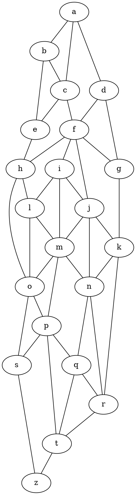

# Chart.js Graphs Dot Parser

[![NPM Package][npm-image]][npm-url] [![Github Actions][github-actions-image]][github-actions-url]

Helper package for [chartjs-chart-graph](https://github.com/sgratzl/chartjs-chart-graph) for parsing DOT files and generate
the data structure for the chart.js plugin.

Input:



Parsed:


## Install

```bash
npm install --save chart.js chartjs-chart-graph chartjs-chart-graph-dot-parser
```

## Usage

see [Samples](https://github.com/sgratzl/chartjs-chart-graph-dot-parser/tree/master/samples) on Github

CodePens

- [Simple Dot File](https://codepen.io/sgratzl/pen/TODO)

## Supported Dot Features

graph types: `graph`, `digraph`

graph attributes:

- `label` ... set as dataset label

node attributes

- `label` ... set the node label
- `color` ... set as node border color
- `fillcolor` ... set a node background color
- `shape` ... only supports: `circle`, `diamond`, and `box`

edge attributes (note: only works with the 3.0.x version of the chartjs-chart-graph plugin due to renaming)

- `color` ... set as edge line/border color
- `penwidth` ... set as edge line/border width

## Development Environment

```sh
npm i -g yarn
yarn set version 2
yarn
yarn pnpify --sdk
```

### Building

```sh
yarn install
yarn build
```

[npm-image]: https://badge.fury.io/js/chartjs-chart-graph-dot-parser.svg
[npm-url]: https://npmjs.org/package/chartjs-chart-graph-dot-parser
[github-actions-image]: https://github.com/sgratzl/chartjs-chart-graph-dot-parser/workflows/ci/badge.svg
[github-actions-url]: https://github.com/sgratzl/chartjs-chart-graph-dot-parser/actions
[codepen]: https://img.shields.io/badge/CodePen-open-blue?logo=codepen
